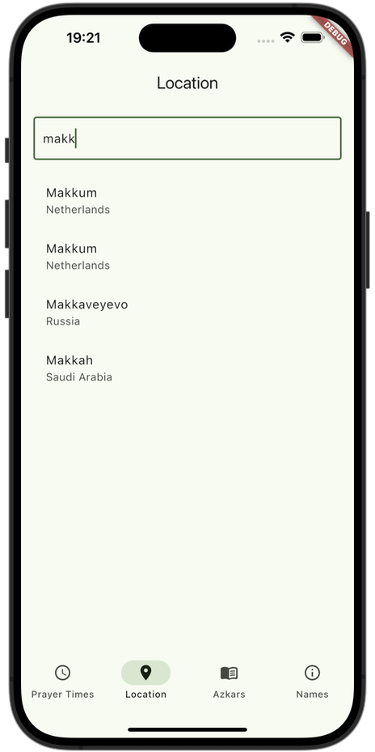
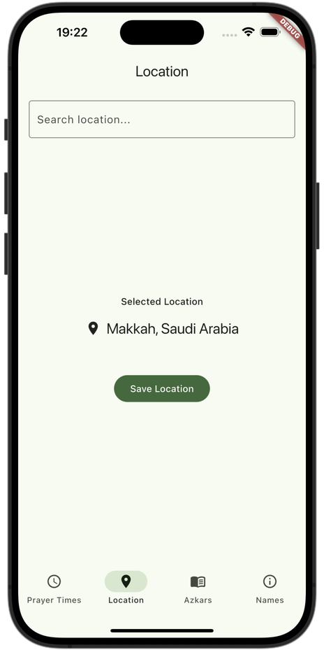
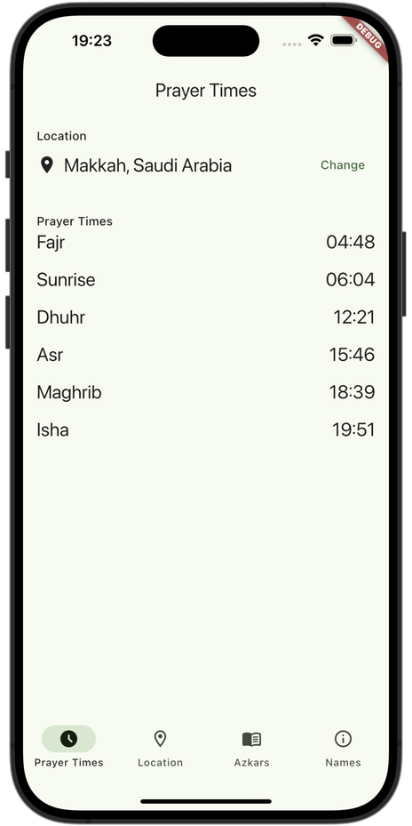
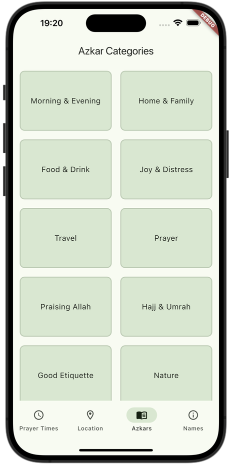
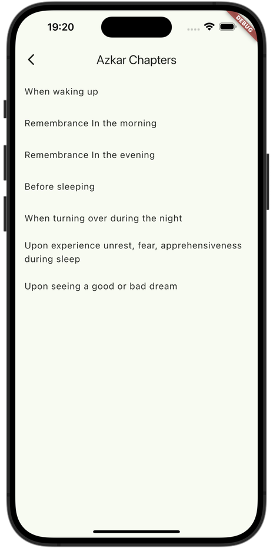
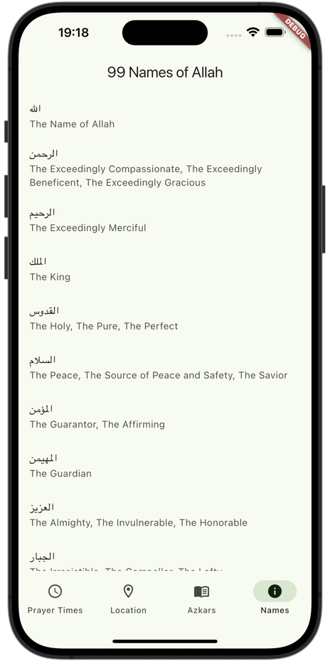

# Muslim Data for Flutter

Muslim Data for Flutter is a cross-platform library that brings Islamic data to your Flutter applications. It unifies features from both Android and iOS versions into a single API so you can easily integrate functionalities such as:

- Fixed or Calculated Prayer Times  
- Offline Geocoding and Reverse Geocoding  
- Location Search  
- Azkars (Hisnul Muslim) with translations  
- 99 Names of Allah with translations  

## Available on Native Platforms

This library is also available for native platform integration:

- [Muslim Data for Android](https://github.com/my-prayers/muslim-data-android)
- [Muslim Data for iOS](https://github.com/my-prayers/muslim-data-ios)

These native libraries share the same concepts and data structure, making it easy to develop similar applications across different platforms.

# Features

✅ **Prayer Times**: Most cities around the world find their prayer times by using some calculations which is based on location (longitude and latitude) but some other cities have fixed time table for their prayer times. This library contains most fixed and calculated prayer times. Now you can contribute it to improve it and also you can use it in Muslim communities or Muslim apps.  
✅ **Location Services**: Search for locations offline, geocode by city name, and reverse geocode using latitude and longitude.  
✅ **Azkars (Hisnul Muslim)**: Retrieve categorized azkars by (Category, Chapter, Item) in various languages.  
✅ **Names of Allah**: Access 99 Names of Allah along with translations in supported languages.

# Usage
Install the package: 

```bash
flutter pub add muslim_data_flutter
```

Import the package in your Dart file:

```dart
import 'package:muslim_data_flutter/muslim_data_flutter.dart';
```

## Location Services

There are some location helper methods in the MuslimRepository that provides **offline Location Search**, **Geocoding**, and **Reverse Geocoding** and also each of one will return `Location` object or list of `Location`. `Location` object contains (`countryCode`, `countryName`, `cityName`, `latitude`, `longitude`, and `hasFixedPrayerTime`).

|              Search Location               |              Selected Location               |
| :----------------------------------------: | :------------------------------------------: |
|  |  |


### Search for a location

You can search for any cities or places around the world and this is useful when a user doesn't have internet connection or user's location is turned off so that you can search here:

```dart
Future<void> searchLocationExample() async {
  final muslimRepo = MuslimRepository();
  final locations = await muslimRepo.searchLocations(locationName: 'makka');

  print("Locations: $locations");
}
```

### Geocode a location

Use geocoder method to find a location by country code and city name.

```dart
Future<void> geocodeLocationExample() async {
  final muslimRepo = MuslimRepository();
  final location = await muslimRepo.geocoder(
    countryCode: "GB",
    locationName: "London",
  );

  if (location != null) {
    print("Location: $location");
  } else {
    print("Location name cannot be geocoded");
  }
}
```

### Reverse Geocode a location

Use reverseGeocoder method to find a location by latitude and longitude.

```dart
Future<void> reverseGeocode() async {
  final muslimRepo = MuslimRepository();
  final location = await muslimRepo.reverseGeocoder(
    latitude: 51.5074,
    longitude: -0.1278,
  );

  if (location != null) {
    print("Location: $location");
  } else {
    print("Location could not be reverse geocoded");
  }
}
```

## Prayer Times
|              Prayer Times               |
| :-------------------------------------: |
|  |

You can easily get prayer times for a location just by passing (`Location`, `PrayerAttribute`, and `Date`) objects to `getPrayerTimes` method.

```dart
Future<void> getPrayerTimesExample() async {
  final muslimRepo = MuslimRepository();

  // Create a PrayerAttribute object.
  final attribute = PrayerAttribute(
    calculationMethod: CalculationMethod.makkah,
    asrMethod: AsrMethod.shafii,
    higherLatitudeMethod: HigherLatitudeMethod.angleBased,
    offset: [0, 0, 0, 0, 0, 0],
  );

  // Assume that 'location' has been retrieved using one of the location methods above.

  final prayerTime = await muslimRepo.getPrayerTimes(
    location: location,  
    date: DateTime.now(),
    attribute: attribute,
  );

  if (prayerTime != null) {
    print("Prayer Times: $prayerTime");
  }
}
```

### Azkars (Hisnul Muslim)
Get all azkars from (Hisnul Muslim book) that is categorized by (`AzkarCategory`, `AzkarChapter`, and `AzkarItem`) and also the azkars are available for these languages (`en`, `ar`, `ckb`, `ckb_BADINI`, `fa`, and `ru`)

| Azkar Categories | Azkar Chapters | Azkar Items |
| :--------------: | :------------: | :---------: |
|  |  |  |


### Azkar Category
Get all azkar categories with its translation for the given language.

```dart
void getAzkarCategoriesExample() async {
  final muslimRepo = MuslimRepository();
  final categories = await muslimRepo.getAzkarCategories(language: Language.en);

  print("Azkar Categories: $categories");
}
```

### Azkar Chapters

Get azkar chapters with its translation for the given language.

```dart
void getAzkarChaptersExample() async {
  final muslimRepo = MuslimRepository();
  final categories = await muslimRepo.getAzkarChapters(language: Language.en);

  print("Azkar Chapters: $categories");
}
```

Get azkar chapters for a specific category with its translation for the given language.


```dart
void getAzkarChaptersExample() async {
  final muslimRepo = MuslimRepository();
  final categories = await muslimRepo.getAzkarChapters(
    language: Language.en,
    categoryId: 1,
  );

  print("Azkar Chapters: $categories");
}
```

Get azkar chapters by chapter ids. This method is particularly useful for implementing a favorites feature on azkar. By just saving the azkar ids, you can later retrieve the full details when needed using this method, simplifying management and synchronization of your favorite azkar entries.

```dart
void getAzkarChaptersExample() async {
  final muslimRepo = MuslimRepository();
  final categories = await muslimRepo.getAzkarChaptersByIds(
    language: Language.en,
    chapterIds: [12, 15],
  );

  print("Azkar Chapters: $categories");
}
```

#### Azkar Items

Get azkar items for a specific chapter and it is localized for the given language.

```dart
void getAzkarItemsExample() async {
  final muslimRepo = MuslimRepository();
  final categories = await muslimRepo.getAzkarItems(
    language: Language.en,
    chapterId: 1,
  );

  print("Azkar Items: $categories");
}
```

### Names of Allah

| 99 Names of Allah |
| :---------------: |
|  |

Get 99 Names of Allah with its translation and it is available for these languages (`en`, `ar`, `ckb`, `ckb_BADINI`, `fa`, and `ru`)

```dart
Future<void> getNamesOfAllah() async {
  final muslimRepo = MuslimRepository();
  final names = await muslimRepo.getNames(language: Language.en);
  print("Names of Allah: $names");
}
```

## Author

Kosrat D. Ahmed  
Email: kosrat.d.ahmad@gmail.com

## License

**Muslim Data for Flutter** is available under the MIT license. See the [LICENSE](LICENSE) file for details.
